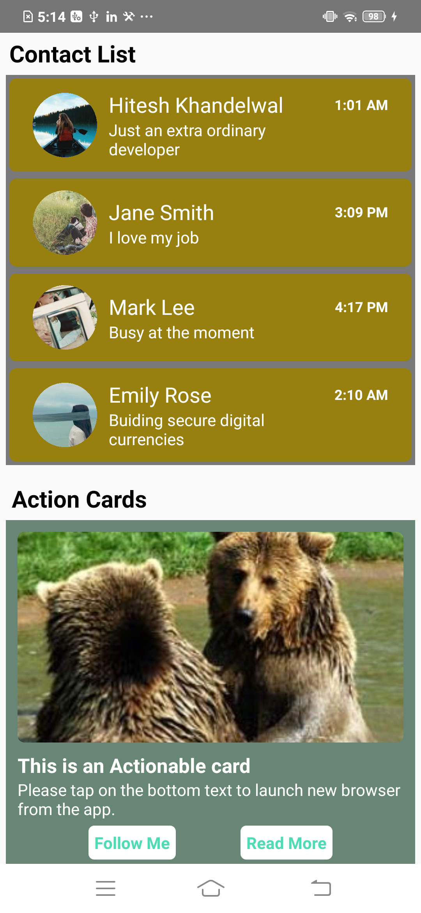
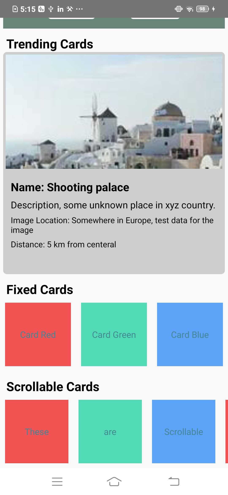

Hi All,

This project has been created as part of my learning journey into React Native. It focuses on the following key concepts:

✅ Core Concepts Covered:
Working with Core Components

Implementing and exploring components such as StyleSheet, useColorScheme, Text, View, etc.

Styling in React Native

Creating reusable styles and applying them to various UI elements like cards and text views.

Implementing Horizontal Scrolling

Using ScrollView with horizontal orientation for better layout control.

Mastering Flexbox

Deep dive into layout handling with Flexbox to achieve responsive designs.

Modular Components (located under the components/ folder):

🟦 Flat Cards: Simple static cards without scroll behavior.

🟨 Horizontal ScrollView with Elevated Cards: Cards presented in a horizontally scrollable view with elevation effects.

🟪 Fancy Cards: Styling and creating cards with images and enhanced layout aesthetics.

🟦 Action Cards: Demonstrates use of Linking.openURL() to open web pages and how the Pressable component triggers click events. Also how we can make them look like a beautiful buttons as well.

🟦 Itiration UI Cards: Demonstrates how we can Iterate UI in react native using an static array list. How the data can be fetched and update the UI from the array list.
Demonstrates how to create a WhatsApp chat design style.

## Screenshots

<h3>📱 WhatsApp design style Screen + Action Cards(clickable event) </h3>

<h3>🎨 Fancy Cards(Fixed and Scrollable)</h3>
