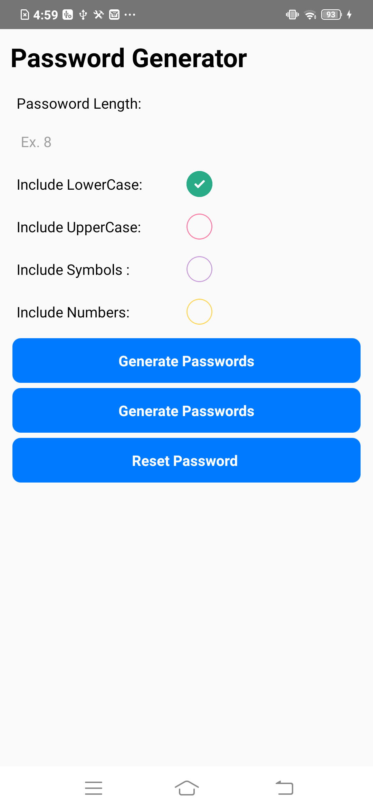

🔐 **Project - Random Password Generator**
This project demonstrates the implementation of a fully functional password generator. Key learning highlights include:

✅ Handling input fields and conditional UI rendering for error messages.

🔢 Triggering the numeric keypad on devices to input digits conveniently.

🔧 Integrating password generation features such as:

-- Uppercase letters
-- Lowercase letters
-- Case sensitivity handling
-- Numbers-only option

*** 📋 Enabling copy-paste functionality to share the generated password easily.***
*** 📦 Usage of multiple third-party libraries (npm packages), including:

-- Yup for input and password validation.
-- React’s useState() hook for managing and updating UI state.
-- A custom function to generate a random password string based on user-selected criteria.
-- Lot of 3rd party libraries used(npm packages)a. Usage of Yup package to set the password validatb. Usage of useState() to set and update the status of any statec. Function to create and generate the password string from random charactersd. 
-- Formik packagee. 
-- Bouncycheckbox

Here is a screenshot:

