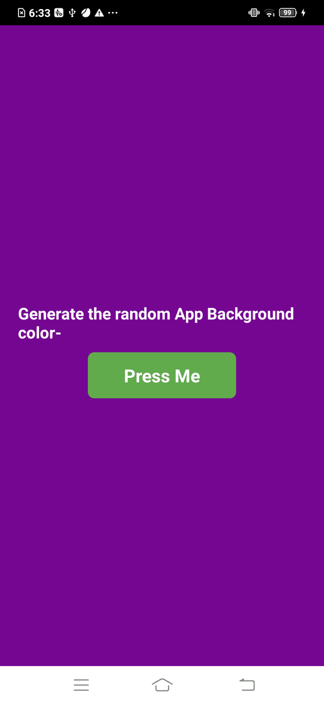

🔐 Project: Random Background Color Generator

This project demonstrates a fully functional random background color generator. Key highlights and learning points include:

✅ Users can press a button to generate a new random background color dynamically.

✅ Utilized Math.floor(Math.random() * 16) to generate a random number, which is then used as an index to pick a value from a predefined hex range.

✅ Implemented **useState** to manage state and update the background color in real time.

✅ Used React Native components like Pressable, View, Text, along with StyleSheet for styling the app.

Here is a screenshot:
  

