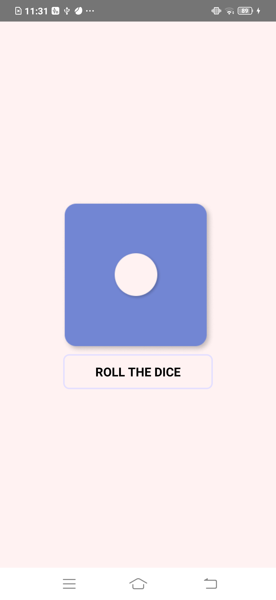
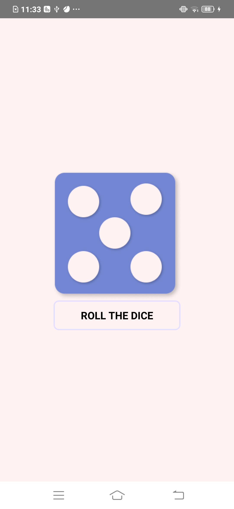
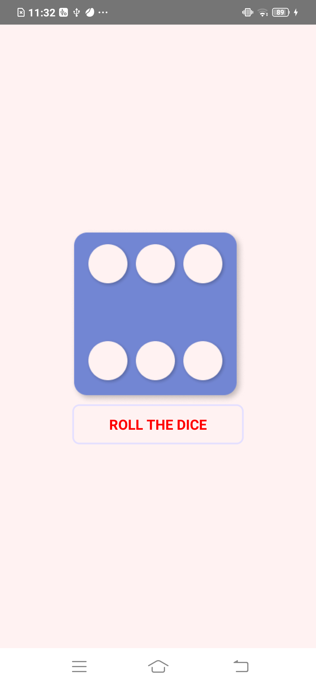

🔐 Project: Dice Roller App

This project demonstrates simulating a dice roll by generating a random number between 1 and 6.

Key Highlights & Learnings:

🎲 Users can tap a button to roll the dice and display a new random number.

🔢 Implemented Math.floor(Math.random() * 6) to generate random values and map them to a predefined range.

📳 Integrated the Haptic Feedback Library to provide tactile feedback when the button is pressed.

🖼️ Imported static images from the Assets folder by declaring them as modules in index.d.ts (declare module "*.png").

⚛️ Utilized React Native components such as ImageSourcePropType, Pressable, View, Text, and applied styling using StyleSheet

Here are some screenshots:
### Random Number Generated
| Default Number | Random Number | Button Pressed|
|--------------|--------------|--------------|
|  |  |  |