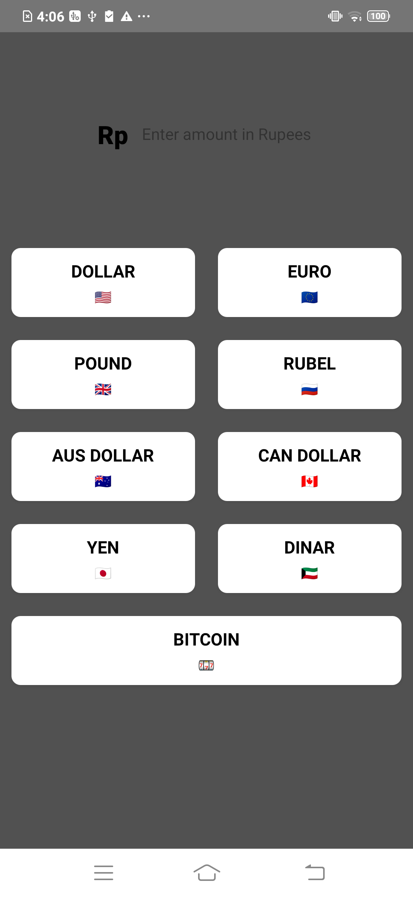
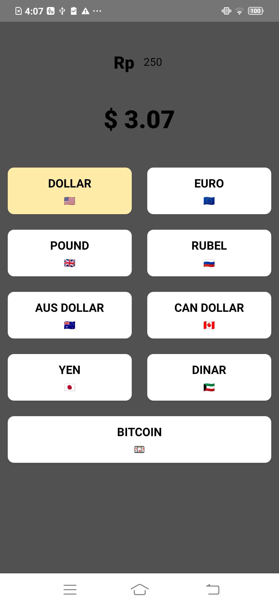
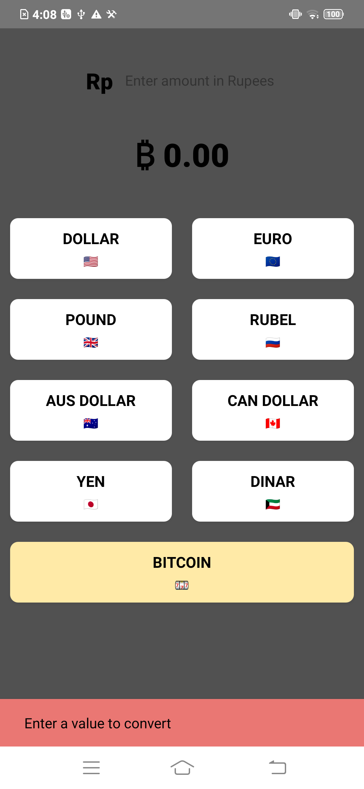

🔐 Project: Currency Converter App

This project showcases currency conversion based on the selected country and the entered INR amount.

Key Features & Learnings:

⚛️ Users can tap on a currency button to convert INR and view real-time conversion rates.

🔢 Used FlatList to display currencies with country name, flag, and conversion value.

🖼️ Defined and imported a Currency type array interface via index.d.ts modules.

🖼️ Declared a constant file to define the array list and passed it to the index.d.ts file.

⚛️ Leveraged React Native components like PropsWithChildren, Pressable, View, Text, and applied styles with StyleSheet.

Here are some screenshots:
### Currency Converter
| Default Number | Button Pressed | Country selected|
|--------------|--------------|--------------|
|  |  |  |